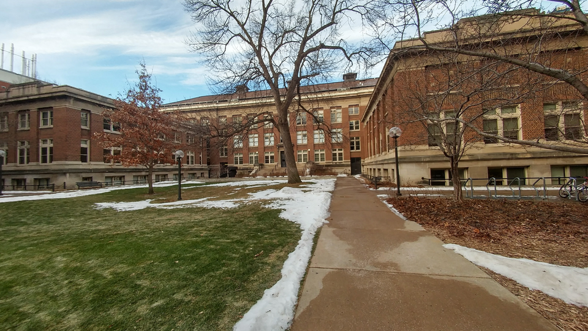
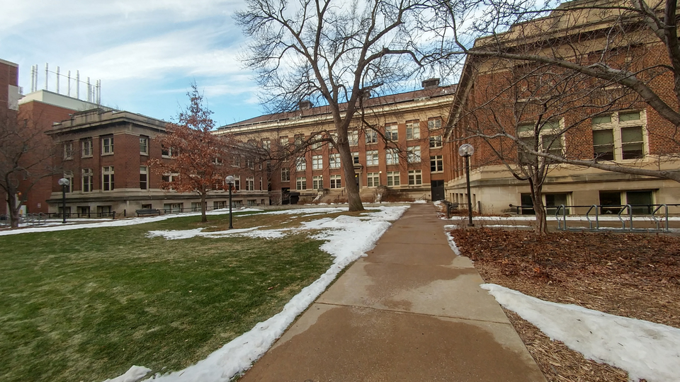

# 3D Reconstruction from Stereo Images

This project demonstrates a complete pipeline for 3D reconstruction from a pair of stereo images.  

The main steps include:
- computing the fundamental matrix,
- camera pose estimation,
- triangulation,
- pose disambiguation,
- image rectification, and
- generating a disparity map.

  
The workflow is implemented in Python with the help of OpenCV, NumPy, and Matplotlib.

## Results

### Input Image Pair

<table>
  <tr>
    <th>LEFT</th>
    <th>RIGHT</th>
  </tr>
  <tr>
    <td></td>
    <td></td>
  </tr>
</table>

### SIFT Feature Matches

### Epipolar Lines

### Camera Pose Disambuigy Correction

<table>
  <tr>
    <th>Camera Poses</th>
    <th>3D Points</th>
  </tr>
  <tr>
    <td></td>
    <td></td>
  </tr>
</table>

### Rectified Images

### Reconstructed Depth Image

Blue represents points closer to the camera, while red represents farther away points.

Note :  I used precomputed SIFT features in this code.

